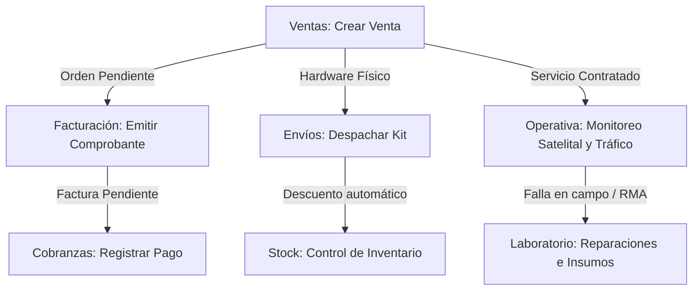

# Documentación del Sistema de Gestión Integrado - Aitue Cominca S.A.

Este documento detalla la arquitectura, el modelo de datos, la seguridad y las funcionalidades desarrolladas en el sistema de gestión interna de **Aitue Cominca S.A.**, una empresa proveedora de telecomunicaciones satelitales y logística de conectividad de alta performance.

---

## 1. Arquitectura Tecnológica y Stack

El sistema ha sido estructurado bajo un paradigma moderno de desarrollo web enfocado en la velocidad y robustez:

* **Framework Principal:** [Next.js 16.2.7](https://nextjs.org) utilizando el nuevo compilador **Turbopack** para tiempos de respuesta instantáneos en desarrollo.
* **Modelo de Enrutamiento:** Next.js App Router (estructura de carpetas en `src/app`).
* **Base de Datos:** SQLite local configurada a través de [Prisma ORM](https://www.prisma.io/).
* **Estilos y UI:** TailwindCSS v4 con una estética oscura premium, bordes definidos, sombras dinámicas y microanimaciones que otorgan una apariencia empresarial moderna.
* **Iconografía:** Lucide React para representaciones visuales intuitivas y consistentes.
* **Lógica del Servidor:** React Server Actions para transacciones seguras directo a la base de datos sin necesidad de endpoints de API expuestos de forma tradicional.

---

## 2. Esquema de Base de Datos (Modelado en Prisma)

La base de datos se administra mediante el archivo [schema.prisma](file:///c:/Users/Ukina/OneDrive/Escritorio/SYSTEM%20FACTORY/prisma/schema.prisma) que comprende 6 áreas relacionales principales:

### 2.1. Usuarios y Permisos
* `User`: Representa al personal del sistema. Almacena contraseñas cifradas, datos personales y rol principal (`ADMIN`, `VENTAS`, `TECNICO`, `COBRANZAS`, `STOCK`).
* `OperatorPermission`: Permite asignar accesos granulares manuales a módulos específicos de manera independiente al rol.
* `AuditLog`: Registra acciones y auditoría de cambios críticos realizados por los operadores en el sistema.

### 2.2. Directorio Maestro de Clientes y Equipamiento
* `Client`: Almacena la información fiscal de las empresas o individuos (Razón Social, CUIT único, datos de contacto).
* `EquipoCliente`: Registra el hardware de conectividad desplegado en campo para cada cliente. Incluye marca (`Starlink` o `Amazon Leo`), tipo (`Fija` o `Móvil`), ubicación exacta (coordenadas, dirección, provincia), proveedor de ancho de banda y tráfico de datos en Gigabytes (Gigas Asignados vs Consumidos).

### 2.3. Ventas y Presupuestos
* `Sale`: Pedidos formales realizados por los ejecutivos. Vincula un cliente, un vendedor y el desglose de productos. Define el estado de la venta (`PENDIENTE`, `FACTURADO`, `ENVIADO`).
* `SaleDetail`: Detalle de artículos/servicios incluidos en cada orden de venta con su cantidad y precio unitario.
* `Quote`: Cotizaciones/Presupuestos. No generan deuda ni afectan el inventario físico (stock) hasta que se conviertan en ventas.
* `Claim`: Registro de reclamos e incidentes de soporte con prioridades asignadas (`URGENTE`, `MEDIO`, `LEVE`).

### 2.4. Facturación y Cobranzas
* `Invoice`: Facturas emitidas vinculadas a una orden de venta. Almacena la URL del documento digital, observaciones y fecha de emisión.
* `Payment`: Pagos realizados que cancelan facturas. Permite adjuntar el comprobante o ticket de transferencia.

### 2.5. Operativa y Envíos
* `Service`: Servicios satelitales corporativos y pools de conectividad.
* `Shipping`: Control de envíos físicos de hardware satelital. Contiene número de seguimiento (tracking), empresa de logística (`Correo Argentino`, `Andreani`, `DHL`) y estado (`PARA_EMPACAR`, `DESPACHADO`).

### 2.6. Control de Stock
* `Product`: Catálogo de ítems en el almacén. Clasifica los elementos por tipo (`PRODUCTO_FINAL`, `ENSAMBLE`, `MATERIA_PRIMA`), cantidades actuales y niveles límite para alertas de escasez (alerta mínima y crítica).

---

## 3. Seguridad y Sistema de Roles (RBAC)

La seguridad del sistema se gestiona de manera centralizada mediante un mecanismo de sesión cifrado en cookies y validado mediante reglas de control de acceso:

* **Autenticación:** El archivo [auth.ts](file:///c:/Users/Ukina/OneDrive/Escritorio/SYSTEM%20FACTORY/src/actions/auth.ts) administra el inicio de sesión. Si las credenciales son correctas, genera un token serializado en formato Base64 que se guarda en la cookie `sessionToken` con directiva `httpOnly` y caducidad de una semana.
* **Control de Rutas:** El archivo [proxy.ts](file:///c:/Users/Ukina/OneDrive/Escritorio/SYSTEM%20FACTORY/src/proxy.ts) intercepta las solicitudes de rutas y valida que el rol o los permisos específicos del token autoricen el acceso al módulo correspondiente. Si no se posee el permiso, se redirige automáticamente al login o al inicio `/`.

---

## 4. Funcionalidades Desarrolladas por Módulo

El sistema cuenta con un total de 11 módulos operativos accesibles a través de una barra lateral inteligente ([Sidebar.tsx](file:///c:/Users/Ukina/OneDrive/Escritorio/SYSTEM%20FACTORY/src/components/Sidebar.tsx)) que oculta o muestra accesos dinámicamente según el rol y los permisos del usuario conectado.

### A. Administrador (`/admin`)
* **Control de Usuarios (ABM):** Permite listar, crear, actualizar (incluyendo cambio opcional de contraseña y roles) y eliminar operadores del sistema.
* **Asignación Granular de Permisos:** Interfaz visual para marcar permisos a áreas específicas de forma independiente al rol predefinido.
* **Historial de Auditoría:** Sección reservada para el listado de actividades del personal (creaciones, bajas, modificaciones de stock).

### B. Ventas (`/ventas`)
* **Consola de Acciones Rápidas:**
  * **Nuevo Cliente:** Acceso directo para registrar nuevos prospectos comerciales con su respectiva información impositiva.
  * **Nueva Venta:** Formulario inteligente para cargar nuevos pedidos. Cuenta con autocompletado en tiempo real de clientes registrados y búsqueda interactiva de productos disponibles en el inventario físico con su nivel de stock actual. Permite configurar costos de envío, descuentos especiales (con registro de supervisor autorizante), tipo de factura solicitada (A, B, C, X) y observaciones operativas.
  * **Presupuesto:** Interfaz simplificada para cotizar servicios.
  * **Nuevo Reclamo:** Permite levantar tickets de soporte reportados por los clientes clasificándolos por prioridad.

### C. Clientes (`/clientes`)
* **Directorio Maestro:** Listado de todas las cuentas registradas con buscador instantáneo por razón social o CUIT.
* **Métricas en Tarjeta:** Cada cliente muestra en resumen la cantidad de equipos satelitales activos y la proporción de tráfico de datos consumida contra la asignada en total de forma dinámica.
* **Perfil Individual (`/clientes/[id]`):**
  * Detalle expandido del cliente.
  * Listado de equipos y consumos con barras de progreso de Gigabytes de color adaptativo (rojo al superar el 90%).
  * Historial de eventos y movimientos de alta/baja de hardware del cliente.
  * Función para exportar ficha técnica a PDF.
* **Baja con Cascada:** Botón de eliminación que borra en una sola transacción segura (vía Prisma `$transaction`) al cliente y todos sus registros vinculados (ventas, facturas, envíos, reclamos y equipos asignados) para evitar inconsistencias en base de datos.

### D. Facturación (`/facturacion`)
* **Cola de Trabajo:** Listado de ventas aprobadas por los ejecutivos que aún no poseen comprobante.
* **Procesamiento de Factura:** Ventana modal para ingresar el número de comprobante fiscal oficial, adjuntar digitalmente el PDF de la factura y derivar la cuenta por cobrar automáticamente al departamento de Cobranzas.

### E. Cobranzas (`/cobranzas`)
* **Filtros por Estado:** Pestañas separadas para facturas pendientes y pagos completados.
* **Semáforo de Vencimiento:** Muestra la fecha límite de pago y alerta con banners en rojo indicando los días de atraso si la factura ya venció.
* **Registrador de Cobro:** Permite ingresar el método de pago (`Transferencia`, `Efectivo`, `Cheque`, `MercadoPago`), fecha de transacción y subir comprobantes bancarios en formato digital.

### F. Operativa (`/operativa`)
* **Centro de Control Satelital:** Panel de monitoreo de anchos de banda para Starlink y Amazon Leo.
* **Agrupación por Cuentas:** Agrupa visualmente los equipos por cliente (mediante interfaz acordeón desplegable) mostrando la suma de tráfico total del cliente.
* **Estado del Nodo:** Indica de forma individual si un kit satelital está `Activo`, `Alerta` o `Suspendido`, detallando su IP, modelo, ubicación física (por ejemplo: "Salta, Tartagal, Base 4") y la red proveedora.
* **Interruptor de Conectividad:** Permite a los técnicos suspender o reactivar el ancho de banda de un nodo de forma inmediata mediante un click.

### G. Envíos (`/envios`)
* **Logística de Despacho:** Muestra el listado de ventas físicas concretadas.
* **Seguimiento:** Permite registrar la transportadora responsable (`Correo Argentino`, `Andreani`, `DHL`), el código de seguimiento (tracking ID) y cambiar el estado logístico de `PARA_EMPACAR` a `DESPACHADO`.

### H. Stock (`/stock`)
* **Filtros de Categoría:** Visualización clasificada del inventario físico (Terminales, Materia Prima, Repuestos).
* **Alertas Inteligentes:** El sistema calcula de forma dinámica y colorea los ítems en base a sus umbrales de stock mínimo (Alerta) y ruptura física (Crítico) para notificar requerimientos de compras de insumos.
* **Ajuste Manual:** Formulario para registrar entradas y salidas manuales de mercadería (por ejemplo, por rotura o auditoría) exigiendo el motivo y el usuario responsable.
* **Libro Diario de Movimientos:** Registro cronológico detallado de entradas y salidas de stock con referencias a órdenes de venta y usuarios.

### I. Laboratorio Técnico (`/laboratorio`)
* **Kanban de RMA:** Tablero de control de reparaciones dividido en cuatro columnas dinámicas (`Ingresados`, `En Reparación`, `Esperando Repuesto`, `Terminados`).
* **Hoja de Ruta Técnica (Modal):** Permite asignar técnicos al caso, redactar diagnósticos técnicos detallados y descontar del stock los repuestos e insumos consumidos para la reparación física de los equipos.

### J. Configuración del WhatsApp Bot (`/bot`)
* **Control de Estado:** Botón de encendido/apagado global del asistente virtual.
* **Editor de Respuestas:** Formularios para cambiar las plantillas de mensajes (Menú de bienvenida, derivación a soporte y mensajes fuera de horario).
* **Previsualización en Celular:** Un mockup de teléfono interactivo que emula en tiempo real cómo visualizará el cliente el chat de WhatsApp de la empresa según el flujo configurado.

### K. Estado Pedidos (`/estado-pedidos`)
* **Tablero de Control de Órdenes:** Vista unificada de los pedidos comerciales, permitiendo a todos los operadores conocer si una orden se encuentra en fase de facturación, empaque en depósito, en camino logístico o ya entregada.

---

## 5. Cuentas de Acceso para Pruebas (Seeding Automático)

El sistema cuenta con un mecanismo de auto-semillero en base de datos. Si al iniciar sesión se utilizan las siguientes credenciales, el sistema crea las cuentas automáticamente con sus respectivos roles y permisos de acceso:

| Correo Electrónico | Contraseña | Rol Asignado | Permisos de Módulos |
| :--- | :--- | :--- | :--- |
| `admin@systemfactory.com` | `admin123` | **ADMIN** | Todos los módulos (A al K) |
| `ventas@systemfactory.com` | `ventas123` | **VENTAS** | Ventas, Clientes, Facturación, Estado de Pedidos |
| `tecnico@systemfactory.com` | `tecnico123` | **TECNICO** | Operativa, Envíos, Laboratorio, Estado de Pedidos |
| `cobranzas@systemfactory.com` | `cobranzas123` | **COBRANZAS** | Facturación, Cobranzas, Estado de Pedidos |
| `stock@systemfactory.com` | `stock123` | **STOCK** | Envíos, Stock, Estado de Pedidos |
