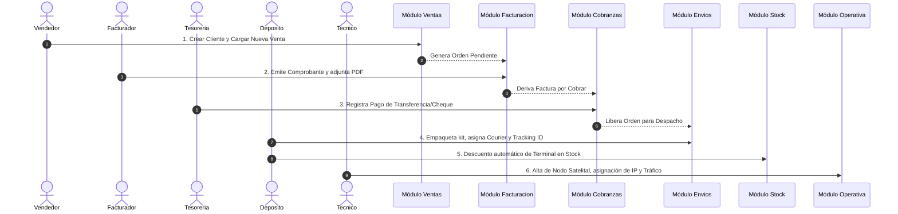

# Manual de Uso Detallado del Sistema de Gestión Integrado
## Aitue Cominca S.A. — Telecomunicaciones Satelitales y Logística Corporativa

---

## 1. Introducción y Visión General del Sistema

El **Sistema de Gestión Integrado de Aitue Cominca S.A.** es una plataforma web integral diseñada para centralizar, automatizar y auditar todas las operaciones comerciales, financieras, logísticas, de inventario y de soporte técnico satelital de la empresa.

### 1.1. Objetivos del Sistema
* **Trazabilidad 360°:** Control unificado desde que se cotiza un kit o servicio satelital hasta su cobranza, despacho, activación en campo y soporte postventa.
* **Monitoreo Satelital en Tiempo Real:** Gestión de equipos Starlink y Amazon LEO, control de anchos de banda, consumos de datos en Gigabytes e interrupción remota de conectividad.
* **Seguridad y Control por Roles (RBAC):** Restricción de pantallas y acciones según la función del usuario y permisos otorgados por la administración.
* **Multirregión / Selección de País:** Operación adaptada a filiales regionales con productos, comprobantes y divisas independientes (ARS, USD, etc.).

---

## 2. Acceso al Sistema, Autenticación y Configuración Regional

### 2.1. Inicio de Sesión (Login)
1. Ingrese a la dirección del sistema en su navegador web (Servidor Local: `http://localhost:2004`).
2. En la pantalla de inicio de sesión (`/login`):
   * Ingrese su **Correo Electrónico** o **CUIT/DNI**.
   * Ingrese su **Contraseña**.
3. Haga clic en el botón **Ingresar al Sistema**.

> [!NOTE]
> La sesión permanece activa mediante cookies cifradas seguras. Si permanece inactivo o cierra sesión manualmente desde la barra lateral, deberá ingresar sus credenciales nuevamente.

### 2.2. Cuentas de Acceso Predefinidas (Para Pruebas y Operación Inicial)
El sistema incluye un mecanismo de semillero automático. Al ingresar con las siguientes credenciales, el usuario se crea automáticamente con sus accesos preconfigurados:

| Rol | Correo Electrónico | Contraseña | Permisos de Módulo Asignados |
| :--- | :--- | :--- | :--- |
| **Administrador** | `admin@systemfactory.com` | `admin123` | Acceso Total a todos los módulos (A al K) |
| **Ejecutivo de Ventas** | `ventas@systemfactory.com` | `ventas123` | Ventas, Ventas Generales, Mercado Libre, Clientes, Facturación, Compras, Estado de Pedidos |
| **Técnico / Operativo** | `tecnico@systemfactory.com` | `tecnico123` | Operativa, Envíos, Laboratorio RMA, Estado de Pedidos |
| **Cobranzas y Finanzas** | `cobranzas@systemfactory.com` | `cobranzas123` | Facturación, Cobranzas, Ventas Generales, Estado de Pedidos |
| **Gestión de Stock** | `stock@systemfactory.com` | `stock123` | Stock, Envíos, Compras, Orden de Compra, OC Exterior, Estado de Pedidos |

### 2.3. Selección de País / Filial Regional (`/select-country`)
Al iniciar sesión por primera vez, el sistema solicitará seleccionar la región de trabajo (por ejemplo: `Argentina`, `España`, `Colombia`, etc.):
* El país seleccionado filtrará el catálogo de stock, comprobantes y divisas aplicables.
* Puede cambiar de país en cualquier momento haciendo clic en el botón **"Cambiar"** situado debajo de la bandera en la barra lateral izquierda.

### 2.4. Personalización Visual (Modo Oscuro / Claro)
En la parte superior de la barra lateral encontrará el botón **ThemeToggle** (icono de Sol/Luna). Presiónelo para alternar entre el tema oscuro premium y el tema claro según su preferencia de visualización.

---

## 3. Estructura de Navegación (Barra Lateral - Sidebar)

La barra lateral izquierda (`Sidebar`) adapta sus opciones dinámicamente según el rol y los permisos del operador conectado:

```
┌────────────────────────────────────────────────────────┐
│  Aitue Cominca S.A.  [ADMIN]             [Sol/Luna]   │
├────────────────────────────────────────────────────────┤
│ 🌐 ARGENTINA                             [Cambiar]    │
├────────────────────────────────────────────────────────┤
│  🛡️  Administrador            (/admin)                 │
│  🛒  Ventas                   (/ventas)                │
│  🛍️  Ventas Generales         (/ventas-generales)      │
│  🏪  Mercado Libre            (/mercado-libre)         │
│  👥  Clientes                 (/clientes)              │
│  🧾  Facturación              (/facturacion)           │
│  🏦  Cobranzas                 (/cobranzas)             │
│  🛍️  Compras                   (/compras)               │
│  📄  Orden de Compra          (/orden-compra)          │
│  🌐  OC Exterior              (/oc-exterior)           │
│  💼  Operativa                (/operativa)             │
│  🚚  Envíos                   (/envios)                │
│  📦  Stock                    (/stock)                 │
│  🧪  Laboratorio              (/laboratorio)           │
│  🤖  Bot                      (/bot)                   │
│  📋  Estado Pedidos           (/estado-pedidos)        │
├────────────────────────────────────────────────────────┤
│  👤  Juan Pérez (admin@systemfactory.com)               │
│  [🚪 CERRAR SESIÓN]                                    │
└────────────────────────────────────────────────────────┘
```

---

## 4. Manual de Uso Detallado por Módulos

---

### 4.1. Módulo Administrador (`/admin`)

Destinado exclusivamente a personal con rol `ADMIN` o con permiso explicito de administración.

#### A. Gestión de Usuarios (ABM de Personal)
* **Visualización:** Lista todos los operadores del sistema indicando su Nombre, DNI/CUIT, Correo, Teléfono, Rol y Cargo.
* **Crear Nuevo Usuario:** 
  1. Haga clic en **"Nuevo Usuario"**.
  2. Complete Nombre, CUIT/DNI (único), Correo electrónico, Contraseña inicial, Rol (`ADMIN`, `VENTAS`, `TECNICO`, `COBRANZAS`, `STOCK`), Teléfono y Cargo.
  3. Guarde para habilitar el acceso.
* **Editar Usuario:** Permite actualizar datos personales, cambiar la contraseña de acceso o modificar el rol asignado.
* **Eliminar Usuario:** Elimina el acceso del operador al sistema de forma permanente.

#### B. Asignación Granular de Permisos por Operador
Permite otorgar excepciones de acceso a módulos específicos sin modificar el rol base del usuario:
1. En la sección **Permisos Granulares**, seleccione el usuario.
2. Marque o desmarque los módulos a los que tendrá acceso (ej: dar acceso a `/facturacion` a un ejecutivo de ventas).
3. Guarde los cambios. El menú lateral del operador se actualizará en tiempo real.

#### C. Bitácora de Auditoría (`AuditLog`)
* Muestra el registro cronológico inalterable de acciones críticas en el sistema: quién realizó la acción, qué operación ejecutó (alta de cliente, modificación de stock, eliminación de venta) y la fecha/hora exacta.

---

### 4.2. Módulo de Ventas (`/ventas`)

Panel de control para ejecutivos comerciales. Ofrece 5 consolas de acción rápida:

#### A. Registrar Nuevo Cliente (`/ventas/nuevo-cliente`)
1. Ingrese CUIT/DNI, Razón Social, Condición de IVA (Responsable Inscripto, Monotributo, Exento, Consumidor Final).
2. Complete Datos de Contacto (Teléfono, Correo principal, Correos adicionales para facturación electrónica).
3. Configure la Ubicación (País, Provincia, Localidad, Código Postal, Dirección de Entrega/Fiscal).
4. Asigne la **Prioridad Comercial** (`ALTA`, `MEDIA`, `BAJA`) y el **Día del Mes para Facturación**.
5. Si corresponde a una sucursal, seleccione el **Cliente Padre** (Sub-nodo).

#### B. Generar Nueva Venta (`/ventas/nueva-venta`)
Formulario inteligente para cargar órdenes de compra formales de clientes:
1. **Selección de Cliente:** Utilice el buscador con autocompletado por CUIT o Razón Social.
2. **Desglose de Productos/Servicios:**
   * Seleccione los productos del catálogo. El sistema mostrará en tiempo real el **Stock Disponible**.
   * Ingrese la cantidad deseada y el precio unitario pactado.
   * Si el producto es un ensamble, podrá seleccionar componentes incluidos.
3. **Parámetros Financieros y Logísticos:**
   * Seleccione la Moneda (`ARS` o `USD`).
   * Indique el Punto de Venta (`TIENDA`, `MERCADO_LIBRE`, `MAIL`) y Tipo de Entrega (`ENVIO` o `RETIRO`).
   * Defina el Tipo de Factura requerida (`A`, `B`, `C`, `X`).
   * Ingrese Costo de Envío si aplica.
   * **Descuentos Especiales:** Ingrese el porcentaje de descuento y especifique obligatoriamente el **Nombre del Supervisor que Autoriza**.
4. Haga clic en **"Confirmar y Generar Venta"**. La orden pasará inmediatamente al módulo de **Facturación** y **Estado de Pedidos**.

#### C. Venta Rápida (`/ventas/venta-rapida`)
Permite registrar una venta ágil ingresando únicamente la Razón Social/Nombre del cliente y los productos, omitiendo requisitos formales de factura inicial para entregas inmediatas de mostrador.

#### D. Presupuesto / Cotización (`/ventas/presupuesto`)
Genera una propuesta comercial preliminar. **No afecta el stock físico ni genera deuda financiera** en cobranzas hasta que sea convertida formalmente a venta.

#### E. Registro de Reclamos e Incidentes (`/ventas/reclamo`)
1. Seleccione el Cliente afectado.
2. Defina el Tipo de Reclamo (Falla de Hardware, Problema de Ancho de Banda, Error de Facturación, Logística).
3. Asigne la Prioridad (`URGENTE`, `MEDIO`, `LEVE`).
4. Detalle las observaciones reportadas por el cliente.
5. Al guardar, el ticket se deriva automáticamente al **Laboratorio Técnico (RMA)** o área correspondiente.

---

### 4.3. Módulo Ventas Generales (`/ventas-generales`)

Consola unificada de control de ventas comerciales:
* **Filtros Avanzados:** Filtrado multidimensional por rango de fechas, estado de la orden (`PENDIENTE`, `FACTURADO`, `PAGADO`, `ENVIADO`), vendedor responsable y cliente.
* **Exportación y Resumen:** Visualización de montos acumulados, totales por divisa y detalle de cada transacción.

---

### 4.4. Módulo Mercado Libre (`/mercado-libre`)

Módulo especializado para la gestión e integración de operaciones provenientes del canal de e-commerce Mercado Libre:
* Visualización de publicaciones, ventas concretadas, preguntas de compradores y estado de despacho sincronizado.

---

### 4.5. Módulo Directorio de Clientes (`/clientes` y `/clientes/[id]`)

#### A. Vista Principal (`/clientes`)
* **Buscador Rápido:** Filtrado instantáneo por CUIT, Razón Social o Provincia.
* **Tarjetas de Cliente:** Muestra de forma sintética el estado de la cuenta, cantidad de equipos satelitales instalados en campo y el porcentaje consumido de su pool de datos de Gigabytes.

#### B. Perfil Expandido del Cliente (`/clientes/[id]`)
Al hacer clic en un cliente, se accede a su ficha técnica completa:
1. **Información Fiscal y Comercial:** CUIT, Condición de IVA, dirección y contactos.
2. **Equipos Satelitales Asignados (`EquipoCliente`):**
   * Muestra los kits desplegados (Starlink / Amazon LEO), Modelo, Tipo de Movilidad (`Fija` o `Móvil`), Número de Serie/MAC, IP asignada, Ubicación geográfica y Coordenadas GPS.
   * **Consumo de Datos:** Barra de progreso dinámica del consumo de Gigabytes (verde `<75%`, amarillo `75%-90%`, rojo `>90%`).
3. **Historial de Eventos (`ClientEvent`):** Cronología de intervenciones, recargas de saldo, reclamos y cambios de plan con opción de adjuntar archivos digitales.
4. **Exportación a PDF:** Botón para descargar la Ficha Técnica del Cliente en PDF oficial para auditoría o entrega al usuario final.
5. **Eliminación Segura en Cascada:** Botón reservado para eliminar al cliente y purgar automáticamente todas sus dependencias relacionadas en una sola transacción garantizada, evitando registros huérfanos.

---

### 4.6. Módulo Facturación (`/facturacion`)

Administrado por el departamento contable y administrativo.

#### A. Cola de Ventas Pendientes de Facturación
Muestra la lista de ventas aprobadas por comercial que aún no tienen comprobante fiscal emitido.

#### B. Emisión y Carga de Factura
1. Localice la venta en la cola de trabajo y haga clic en **"Emitir Factura"**.
2. Ingrese el **Número de Comprobante Fiscal Oficial** (Ej: `FC-A-0001-00008492`).
3. Adjunte opcionalmente el archivo PDF o imagen de la factura.
4. Redacte observaciones para el área de cobranzas si fuera necesario.
5. Confirme la carga. El pedido cambiará su estado a `FACTURADO` y la factura se derivará automáticamente al módulo de **Cobranzas**.

---

### 4.7. Módulo Cobranzas (`/cobranzas`)

Diseñado para el seguimiento de la cartera de créditos y el registro de cobranzas de facturas emitidas.

#### A. Semáforo de Vencimiento de Facturas
* **Pestaña Facturas Pendientes:** Muestra las facturas emitidas que aguardan pago.
* **Alertas Visuales:** Destaca en tono rojo parpadeante las facturas cuya fecha de vencimiento ha expirado, indicando el número exacto de días de mora.

#### B. Registrar Cobro / Pago
1. Haga clic en **"Registrar Pago"** sobre la factura correspondiente.
2. Seleccione el **Método de Pago** (`Transferencia Bancaria`, `Efectivo`, `Cheque`, `MercadoPago`).
3. Ingrese la **Fecha Real de Cobro**.
4. Adjunte el **Comprobante Digital** (Foto del ticket, PDF de transferencia bancaria).
5. Al confirmar, la factura pasa a la pestaña **"Pagos Completados"** y la orden habilita su despacho inmediato en depósito y logística.

---

### 4.8. Módulos de Compras, Órdenes de Compra y OC Exterior (`/compras`, `/orden-compra`, `/oc-exterior`)

Módulos destinados a la gestión de insumos internos e importaciones internacionales de hardware satelital.

#### A. Requerimientos de Compra Interna (`/compras`)
* Los operadores de áreas (Laboratorio, Operativa, Depósito, Oficina) pueden cargar solicitudes de compra especificando: Tipo de Artículo (Consumibles, Repuestos, Equipos), Cantidad, Monto Aprox., Área Destino y Enlace de Referencia.
* Administración revisa, aprueba o rechaza los requerimientos.

#### B. Órdenes de Compra Locales (`/orden-compra`)
* Consolidación de solicitudes aprobadas en Órdenes de Compra formales a proveedores locales, registrando facturas de compra y pagos a proveedores.

#### C. Órdenes de Compra al Exterior (`/oc-exterior`)
* **Gestión de Importaciones Satelitales:** Registro de compras internacionales (Starlink, antenas, transceivers) expresadas en divisas extranjeras (USD).
* **Seguimiento de Embarque:** Seguimiento de fecha estimada de llegada al país, comprobantes de aduana/importación y panel de **Verificación Físico de Items** para confirmar la entrada exacta de hardware al depósito al momento del arribo.

---

### 4.9. Módulo Operativa Satelital (`/operativa`)

Centro de Control y Monitoreo del Parque Satelital en Campo (Starlink y Amazon LEO).

#### A. Monitoreo por Cliente (Vista Acordeón)
* Agrupa las terminales activas por cliente.
* Muestra la suma consolidada de datos asignados vs consumidos por la flota de la empresa cliente.

#### B. Ficha Técnica del Nodo Satelital
Para cada equipo en campo se detalla:
* **Estado:** `Activo`, `Alerta` o `Suspendido`.
* **Marca y Proveedor:** Starlink / Amazon LEO — Telespazio / Telefónica / Ale MC.
* **Identificador de Servicio:** Número de Kit, Número de Serie o MAC Address.
* **IP y Ubicación:** Dirección IP pública asignada, Coordenadas GPS y dirección física del sitio (Ej: "Yacimiento Vaca Muerta - Pozo 12").

#### C. Interruptor Remoto de Conectividad (ON/OFF)
* Los técnicos autorizados disponen de un **Switch de Conectividad** en pantalla.
* Al hacer clic, se altera en tiempo real el estado del servicio entre `Activo` y `Suspendido`, permitiendo cortar el tráfico ante falta de pago o mantenimiento de red.

---

### 4.10. Módulo Envíos y Logística (`/envios`)

Gestión de depósitos, empaque y despacho físico de equipamiento.

#### A. Control de Despachos
Muestra los pedidos comerciales que requieren envío físico de hardware.

#### B. Procesamiento del Envío
1. Al recibir la orden aprobada, el personal de depósito empaqueta el kit satelital o insumo.
2. Seleccione la **Empresa de Transportadora / Courier** (`Correo Argentino`, `Andreani`, `DHL`, `Flete Propio`).
3. Ingrese el **Código de Seguimiento (Tracking ID)**.
4. Indique la cantidad de cajas/bultos utilizados.
5. Actualice el estado logístico:
   * `PARA_EMPACAR` ➔ `EMPACADO` ➔ `DESPACHADO` ➔ `ENTREGADO`.

---

### 4.11. Módulo Control de Stock e Inventarios (`/stock`)

Administración del catálogo de hardware, insumos y componentes.

#### A. Clasificación de Inventario
* **PRODUCTO_FINAL:** Terminales completas Starlink, Routers, Parabólicas.
* **ENSAMBLE:** Kits armados con soportes y cableado customizado.
* **MATERIA_PRIMA / REPUESTOS:** Connectores, cables de alimentación, fuentes, herrajes.

#### B. Alertas Inteligentes de Escasez
El sistema evalúa dinámicamente el nivel de inventario contra dos umbrales configurados:
* 🟨 **Alerta Mínima (Amarillo):** El nivel de stock está próximo a agotarse. Se sugiere generar orden de compra.
* 🟥 **Alerta Crítica (Rojo):** Stock en niveles de ruptura física. Riesgo de detener entregas.

#### C. Ajuste Manual de Inventario (Entradas / Salidas)
Para registrar ingresos por compra local o bajas por rotura/auditoría:
1. Haga clic en **"Ajustar Stock"**.
2. Seleccione el producto y el tipo de movimiento (`ENTRADA` o `SALIDA`).
3. Ingrese la cantidad.
4. **Motivo Obligatorio:** Redacte la justificación de la modificación (Ej: "Recepción de OC-402" o "Placa dañada en prueba de laboratorio").

#### D. Libro Diario de Movimientos
Registro inalterable con el historial completo de entradas y salidas de stock, detallando fecha, cantidad, motivo, orden de venta relacionada y usuario que ejecutó la operación.

---

### 4.12. Módulo Laboratorio Técnico RMA (`/laboratorio`)

Gestión de servicio técnico, reparaciones y garantías de equipos satelitales.

#### A. Tablero Kanban de RMA
Organizado en 4 columnas dinámicas para un seguimiento visual del estado de las reparaciones:

```
┌─────────────────┬─────────────────┬────────────────────┬─────────────────┐
│  1. INGRESADOS  │ 2. EN REPARACIÓN│3. ESPERANDO REPUEST│  4. TERMINADOS  │
├─────────────────┼─────────────────┼────────────────────┼─────────────────┤
│ [Ticket #102]   │ [Ticket #098]   │ [Ticket #094]      │ [Ticket #088]   │
│ Client: Apache  │ Client: Pluspe  │ Client: YPF        │ Client: Vista   │
│ Equipo: Starlink│ Equipo: Router  │ Espera: Cable PoE  │ Reparado OK     │
└─────────────────┴─────────────────┴────────────────────┴─────────────────┘
```

#### B. Hoja de Ruta Técnica (Gestión del Ticket)
Al abrir una tarjeta del Kanban:
1. **Asignación de Técnico:** Seleccione el profesional responsable del caso.
2. **Informe de Diagnóstico:** Ingrese el análisis técnico detallado de la falla detectada.
3. **Consumo de Repuestos con Descuento Automático de Stock:**
   * Seleccione del catálogo los repuestos o insumos consumidos para la reparación (Ej: 1x Cable PoE, 1x Conector RJ45 Industrial).
   * Al guardar la hoja de ruta, el sistema **descontará automáticamente las unidades del módulo de Stock**.
4. Mueva la tarjeta a `Terminado` para notificar al cliente o autorizar su posterior re-despacho en Envíos.

---

### 4.13. Módulo WhatsApp Bot / Asistente Virtual (`/bot`)

Configuración del canal de atención automatizada por WhatsApp.

#### A. Control de Operación Global
* **Switch Principal:** Enciende o apaga la respuesta automática del bot.

#### B. Editor de Mensajes y Plantillas
Permite personalizar los textos de interacción automatizada:
* **Mensaje de Bienvenida:** Saludo inicial y menú de opciones principales.
* **Mensaje de Derivación a Soporte:** Texto enviado al transferir con un operador humano.
* **Mensaje Fuera de Horario:** Respuesta automática emitida fuera del horario laboral.

#### C. Base de Conocimiento para IA (RAG)
* Carga de artículos, preguntas frecuentes y especificaciones técnicas que la Inteligencia Artificial utiliza para responder consultas complejas de clientes de forma autónoma.

#### D. Previsualización Interactiva en Simulador
Muestra un teléfono celular virtual en pantalla que emula en tiempo real la experiencia que vivirá el cliente al chatear con el bot de la empresa.

---

### 4.14. Módulo Estado de Pedidos - Trazabilidad Unificada (`/estado-pedidos`)

Consola de control de trazabilidad en 6 etapas continuas para todo el personal de la empresa:

```
┌─────────────┬─────────────┬─────────────┬─────────────┬─────────────┬─────────────┐
│ 1. INGRESO  │2.FACTURACIÓN│ 3. COBRANZA │4.PREPARACIÓN│5.EN TRÁNSITO│ 6.ENTREGADO │
└─────────────┴─────────────┴─────────────┴─────────────┴─────────────┴─────────────┘
```

#### A. Trazabilidad por Etapa
Permite identificar en qué punto de la cadena de valor se encuentra cada pedido comercial en tiempo real:
1. **Ingreso:** Venta cargada por el ejecutivo.
2. **Facturación:** En proceso de emisión de comprobante contable.
3. **Cobranzas:** En espera de confirmación de pago por tesorería.
4. **Preparación:** En empaque y configuración técnica en depósito.
5. **En Tránsito:** Despachado por courier con código de tracking asignado.
6. **Entregado:** Recibido conforme por el cliente final.

#### B. Indicador / Semáforo de Tiempo Transcurrido
Cada tarjeta calcula los días transcurridos desde que se generó el pedido:
* 🟩 **1 a 4 días (Normal):** Procesamiento dentro de los plazos estándar.
* 🟨 **5 a 6 días (Advertencia):** Requiere atención prioritaria para evitar retrasos.
* 🟥 **Más de 6 días (Demorado):** Destacado con borde rojo animado para intervención inmediata.

#### C. Ventana de Detalle y Bitácora de Observaciones
Al hacer clic en cualquier tarjeta:
* Visualice la cadena de proceso con indicadores de avance paso a paso.
* Revise el detalle de clientes, artículos y totales de la transacción.
* **Bitácora de Observaciones:** Permite a operadores de cualquier área escribir notas de seguimiento internas (Ej: "Cliente solicita entregar después de las 14hs").
* **Bypass de Facturación/Cobranza (Exclusivo Administrador):** Botón especial que permite a administradores saltear los pasos contables para pedidos de emergencia, enviando el kit directamente a preparación y despacho.

---

### 4.15. Módulos Auxiliares: Calendario, Chat y Perfil

#### A. Calendario (`/calendario`)
* Programación de reuniones, visitas técnicas a campo, vencimientos de contratos de servicios y alertas de mantenimiento. Soporta visibilidad individual o compartida globalmente.

#### B. Mensajería Interna (`/chat`)
* Chat directo entre operadores del sistema para coordinar entregas, consultas de stock o validaciones de pago sin salir de la plataforma.

#### C. Mi Perfil (`/perfil`)
* Permite al operador actualizar su foto de perfil, teléfono de contacto y revisar sus permisos vigentes.

---

### 4.16. Módulo Webmail Gmail & Google Workspace (`/correo`)

Cliente de correo electrónico integrado y sincronizado con cuentas corporativas de Google.

#### A. Vinculación con Google OAuth 2.0 y SMTP
* **Sesión Autorizada:** Cada usuario puede vincular su propia casilla de Google Gmail mediante inicio de sesión OAuth 2.0 o clave de aplicación SMTP de 16 caracteres.
* **Sesión Permanente:** Mantiene la casilla conectada de forma segura para enviar y recibir correos directamente desde la interfaz corporativa.

#### B. Navegación Cómoda y Filtros Inteligentes
* **Pestañas de Filtrado Rápido:** Alterna entre *Todos*, *Sin Leer*, *Destacados* y *Con Adjuntos* en un clic.
* **Buscador en Tiempo Real:** Búsqueda instantánea por remitente, asunto, contenido de texto o presencia de archivos adjuntos.
* **Acciones Múltiples:** Botón para marcar todos los mensajes como leídos y actualización instantánea de la bandeja.

#### C. Envío y Lectura de Archivos Adjuntos
* **Adjuntar Documentos:** Selector con soporte para arrastrar y soltar múltiples archivos (PDF, Excel, Word, imágenes) con cálculo automático de peso en KB/MB y envío en Base64.
* **Visor y Descarga:** Sección *Archivos Adjuntos (N)* en la lectura de correos con íconos identificadores según el tipo de documento y botón de descarga directa.

#### D. Integración con Aitue AI (Asistente Virtual)
* **Búsqueda y Resumen:** Aitue AI puede consultar los correos del usuario (`search_user_emails`) para resumir mensajes o verificar documentos adjuntos.
* **Redacción y Envío por Chat:** Permite pedir a Aitue AI que redacte y envíe un correo electrónico en nombre del usuario (`send_email_via_ai`).

---

## 5. Circuitos Operativos Recomendados (Paso a Paso)

### Circuito 1: Flujo Completo de Venta y Entrega de Hardware Satelital



1. **Vendedor (`/ventas`):** Registra al cliente y genera la venta seleccionando el kit satelital.
2. **Facturador (`/facturacion`):** Revisa la venta, asigna el número de factura fiscal oficial y adjunta el PDF.
3. **Tesorería (`/cobranzas`):** Revisa la factura pendiente, registra el cobro y adjunta el comprobante bancario.
4. **Depósito (`/envios`):** Al confirmarse el pago, empaqueta el kit, asigna la transportadora (ej: Andreani) e ingresa el número de seguimiento.
5. **Inventario (`/stock`):** El sistema descuenta la terminal enviada del inventario disponible.
6. **Operativa (`/operativa`):** El equipo técnico da de alta el nodo en la consola satelital, configurando la IP, el plan de Gigabytes y la ubicación del sitio en campo.

---

### Circuito 2: Flujo de Soporte Técnico y Garantía (RMA)

1. **Atención al Cliente (`/ventas/reclamo`):** Registra el inconveniente reportado por el cliente con prioridad `URGENTE`.
2. **Laboratorio Técnico (`/laboratorio`):** El ticket ingresa en la columna `Ingresados` del tablero Kanban.
3. **Diagnóstico e Intervención:** El técnico arrastra la tarjeta a `En Reparación`, redacta la falla detectada en la Hoja de Ruta e indica los repuestos a sustituir (Ej: Fuente de alimentación).
4. **Descuento de Insumos:** Al guardar, el sistema descuenta automáticamente los repuestos consumidos del Módulo de Stock.
5. **Cierre y Entrega:** Se mueve la tarjeta a `Terminado` y se notifica al cliente o a logística para el reenvío del equipo reparado.

---

## 6. Preguntas Frecuentes y Solución de Problemas (FAQ)

### ¿Qué debo hacer si una venta requiere envío urgente y la factura aún no fue emitida?
Un operador con rol **ADMIN** puede ingresar a la orden desde el módulo `/estado-pedidos`, abrir el detalle del pedido y presionar el botón **"Omitir Facturación y Cobranza"**. Esto enviará el pedido directamente a la etapa de Preparación y Despacho Logístico.

### ¿Cómo sé si un cliente ha superado su límite de datos satelitales?
Consulte el módulo `/operativa` o el perfil del cliente en `/clientes/[id]`. Las barras de consumo de Gigabytes se mostrarán en **rojo** cuando superen el 90% de su plan asignado. Desde el módulo `/operativa`, un técnico puede suspender temporalmente el servicio o recargar Gigabytes adicionales.

### ¿Por qué no puedo visualizar ciertos módulos en la barra lateral?
La barra lateral solo muestra los módulos autorizados para su **Rol** o aquellos concedidos individualmente a través de la sección de **Permisos Granulares** por el Administrador. Si requiere acceso a una sección adicional, solicite a un administrador que actualice sus permisos en `/admin`.

---
*Manual elaborado para la plataforma de gestión de Aitue Cominca S.A. — Versión 1.0*
